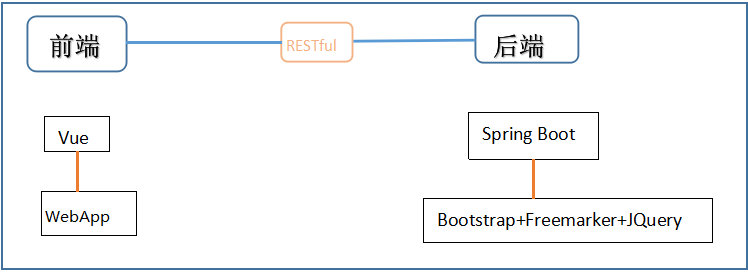
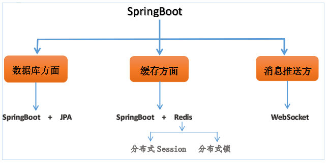

## 基于SpringBoot的微信点餐系统
>这里只是对项目做一个整体的介绍，项目中设计的知识细节及难点以博客的形式整理在Wiki里。[Wiki](https://github.com/sqmax/springboot-project/wiki)

### 目录
* [项目介绍](#项目介绍)
* [项目设计](#项目设计)
    * [角色划分](#角色划分)
    * [功能模块划分](#功能模块划分)
    * [部署架构](#部署架构)
    * [数据库设计](#数据库设计)
* [项目使用的技术栈](#项目使用的技术栈)
* [开发环境及工具](#开发环境及工具)
* [项目演示](#项目演示)
    * [卖家端（PC端）](#卖家端（PC端）)
    * [买家端（手机微信端）](#买家端（手机微信端）)
    * [买家端和卖家端的通信](#买家端和卖家端的通信)

---

## 项目介绍  
* 前端是由Vue.js构建的WebApp，后端由Spring Boot打造，后端的前台页面使用Bootstrap+Freemarker+JQuery构建,后端和前端通过RESTful风格的接口相连。

* 数据库方面使用Spring Boot+JPA，兼顾Spring Boot+Mybatis；缓存方面，使用Spring Boot+Redis；基于Redis，应对分布式Session和锁；消息推送方面，使用WebSocket。      

* 这是一个基于微信的点餐系统，所以还涉及许多微信相关的特性，如微信扫码登陆，微信模板消息推送和微信支付和退款。

## 项目设计

### 角色划分
* 买家（手机端）：由微信公众号提供的一个服务。
* 卖家（PC端）：一个简单的商家管理系统

### 功能模块划分
* 功能分析   
       
* 关系图           
       

### 部署架构
* 买家端在手机端，卖家端在PC端，两端都会发出数据请求，请求首先到达nginx服务器，如果请求的是后端接口，nginx服务器会进行一个转发，转发到后面的Tomcat服务器，即我们的Java项目所在，如果这个接口作了缓存，那么就会访问redis服务器，如果没有缓存，就会访问我们的MySQL数据库。值得注意的是我们的应用是支持分布式部署的，也就是说图上的Tomcat表示的是多台服务器，多个应用。
    
### 数据库设计
*  共5个表，表之间的关系如下，其中商品表存放的就是商品的名称、价格、库存、图片链接等信息；类目表含有类目id、类目名字等信息，一个类目下有多种商品，类目表和商品表之间是一对多的关系；订单详情表含有购买的商品名称、数量、所属订单的订单号等信息；订单主表包含包含该订单的订单号、买家的信息、订单的支付状态等信息，订单主表和订单详情表之间是一对多的关系；最后是卖家信息表，存放的卖家的账号和密码等信息，作为卖家后台管理的权限认证。   
           

## 项目使用的主要技术栈
* Spring Boot的相关特性
    * Spring Boot+JPA
    * Spring Boot+Redis
    * Spring Boot+WebSocket
    
* 微信相关特征
    * 微信支付、退款
    * 微信授权登陆
    * 微信模板消息推送
    * 使用微信相关的开源SDK
* 利用Redis应用分布式Session和锁
    * 对用户的登陆信息使用分布式Session存储
    * 利用一个抢购商品的例子，来对Redis分布式锁进行详细的说明

## 开发环境及工具
* IDEA   
* Maven   
* Git   
* MySQL
* Nginx
* Redis                
* Postman模拟微信订单创建订单
* Fiddler对手机请求抓包    
* Natapp内网穿透       
* Apache ab模拟高并发，抢购一个商品

## 项目演示   

### 卖家端（PC端）  

浏览器输入授权路径,进入微信扫码登陆系统页面         

                                                         

登陆后，从左侧导航栏可以看到有四项【订单】、【商品】、【类目】、【登出】，右侧是卖家管理系统的首页，也即【订单】界面。   

   

 对每项订单有【取消】和【详情】操作。点击【详情】来查看订单详情，来到下面的界面：
 
 
 
 我们可以选择【完结订单】或【取消订单】。       

【商品】和【商品类目】下均有两项操作：【列表】【新增】。      
下面以【商品】栏为例演示。     
点击【商品】->【列表】可以查看商品的详情，可以看到对每件商品又有【修改】和【上架】/【下架】操作 。       

点击商品->新增来新增商品        
      
 
### 买家端（手机微信端）
买家端是基于微信公众号的点餐app。      

选购好商品后就可以去结算。

结算完成，可以看到一条微信支付凭证消息。

可以选择查看账单。

### 买家端和卖家端的通信
因为我是借用的微信公众账号，买家端和卖家端不能连调，我这里用Postman这个工具，发送一条post请求，来模拟微信下单。这时卖家端首页，即【订单】页面就会弹出一个窗口，并播放音乐。   

  

点击关闭按钮，在订单页面找到找到新下的订单，点击【详情】来到订单详情界面，点击【完结订单】按钮。

这时微信那边就会收到如下的模板消息。   

